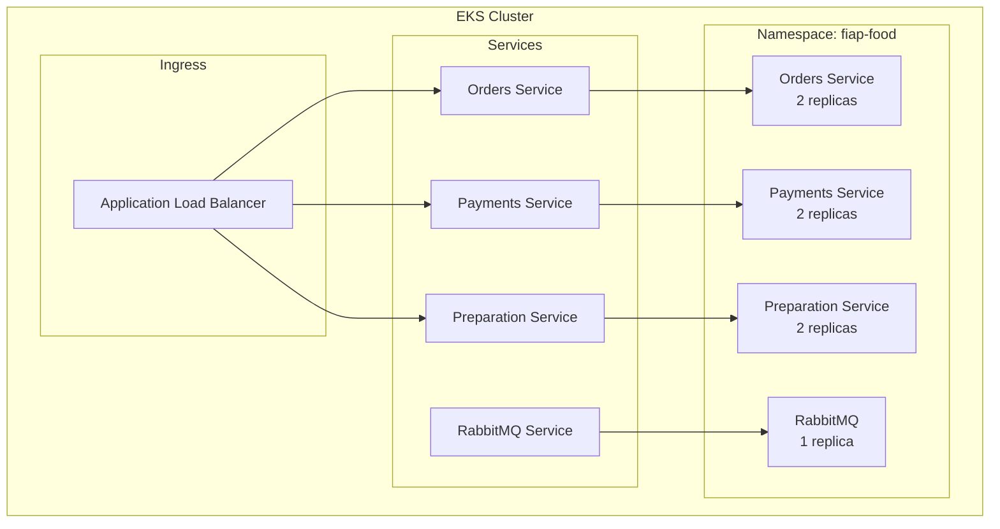

# FIAP Food Kubernetes - Infraestrutura EKS

## 📋 Descrição

Este repositório contém a infraestrutura como código (IaC) para provisionar um cluster Kubernetes na AWS utilizando EKS, responsável por orquestrar todos os microsserviços da aplicação FIAP Food.

### Responsabilidades
- Provisionar cluster EKS na AWS
- Configurar node groups para workloads
- Gerenciar rede e segurança
- Configurar auto-scaling
- Integrar com outros serviços AWS

## 🏗️ Arquitetura

### Tecnologias Utilizadas
- **IaC**: Terraform
- **Orquestração**: Kubernetes (EKS)
- **Cloud**: AWS
- **Networking**: VPC, Subnets, Load Balancers
- **Segurança**: IAM Roles, Security Groups

### Especificações do Cluster
- **Versão**: Kubernetes 1.28
- **Tipo**: EKS Managed
- **Região**: us-east-1
- **Node Group**: t3.medium (2 vCPUs, 4GB RAM)
- **Scaling**: 1-3 nodes (auto-scaling)

## 🏗️ Componentes da Infraestrutura

### VPC e Networking
```hcl
# VPC Configuration
resource "aws_vpc" "fiap_food_vpc" {
  cidr_block           = "10.0.0.0/16"
  enable_dns_hostnames = true
  enable_dns_support   = true
}

# Subnets públicas e privadas
resource "aws_subnet" "public" {
  count                   = 2
  vpc_id                  = aws_vpc.fiap_food_vpc.id
  cidr_block              = "10.0.${count.index + 1}.0/24"
  availability_zone       = data.aws_availability_zones.available.names[count.index]
  map_public_ip_on_launch = true
}

resource "aws_subnet" "private" {
  count             = 2
  vpc_id            = aws_vpc.fiap_food_vpc.id
  cidr_block        = "10.0.${count.index + 10}.0/24"
  availability_zone = data.aws_availability_zones.available.names[count.index]
}
```

### EKS Cluster
```hcl
resource "aws_eks_cluster" "fiap_food_cluster" {
  name     = "fiap-food-cluster"
  role_arn = aws_iam_role.eks_cluster_role.arn
  version  = "1.28"

  vpc_config {
    subnet_ids = concat(aws_subnet.public[*].id, aws_subnet.private[*].id)
  }
}
```

## 🚀 Deploy e Configuração

### Pré-requisitos
- AWS CLI configurado
- Terraform >= 1.5.0
- kubectl instalado
- Credenciais AWS com permissões EKS

### Variáveis de Ambiente
```bash
# Configurar no arquivo .env ou terraform.tfvars
AWS_REGION=us-east-1
CLUSTER_NAME=fiap-food-cluster
NODE_GROUP_INSTANCE_TYPE=t3.medium
MIN_SIZE=1
MAX_SIZE=3
DESIRED_SIZE=2
```

### Comandos de Deploy

```bash
# Inicializar Terraform
terraform init

# Planejar mudanças
terraform plan

# Aplicar infraestrutura
terraform apply

# Configurar kubectl
aws eks update-kubeconfig --region us-east-1 --name fiap-food-cluster
```

### Outputs Disponíveis
- `cluster_endpoint`: Endpoint do cluster EKS
- `cluster_security_group_id`: ID do security group
- `cluster_iam_role_arn`: ARN da role IAM do cluster
- `node_group_arn`: ARN do node group
- `vpc_id`: ID da VPC criada

## 🔗 Microsserviços Implantados

### Arquitetura de Pods


### Deployments Configurados
```yaml
# Orders Service
apiVersion: apps/v1
kind: Deployment
metadata:
  name: orders-service
  namespace: fiap-food
spec:
  replicas: 2
  selector:
    matchLabels:
      app: orders-service
  template:
    metadata:
      labels:
        app: orders-service
    spec:
      containers:
      - name: orders-service
        image: thallis/fiap-food-orders:latest
        ports:
        - containerPort: 3000
        env:
        - name: MONGODB_URI
          valueFrom:
            secretKeyRef:
              name: mongodb-secret
              key: connection-string
```

## 📊 Monitoramento e Observabilidade

### Métricas do Cluster
- CPU e memória dos nodes
- Utilização de pods
- Network I/O
- Storage utilization

### Logs Centralizados
```bash
# Verificar logs dos pods
kubectl logs -n fiap-food deployment/orders-service
kubectl logs -n fiap-food deployment/payments-service
kubectl logs -n fiap-food deployment/preparation-service
```

### Health Checks
```yaml
# Liveness e Readiness Probes
livenessProbe:
  httpGet:
    path: /health
    port: 3000
  initialDelaySeconds: 30
  periodSeconds: 10

readinessProbe:
  httpGet:
    path: /ready
    port: 3000
  initialDelaySeconds: 5
  periodSeconds: 5
```

## 🔒 Segurança

### IAM Roles e Políticas
```hcl
# EKS Cluster Role
resource "aws_iam_role" "eks_cluster_role" {
  name = "eks-cluster-role"

  assume_role_policy = jsonencode({
    Version = "2012-10-17"
    Statement = [
      {
        Action = "sts:AssumeRole"
        Effect = "Allow"
        Principal = {
          Service = "eks.amazonaws.com"
        }
      }
    ]
  })
}

# Node Group Role
resource "aws_iam_role" "node_group_role" {
  name = "eks-node-group-role"
  
  assume_role_policy = jsonencode({
    Version = "2012-10-17"
    Statement = [
      {
        Action = "sts:AssumeRole"
        Effect = "Allow"
        Principal = {
          Service = "ec2.amazonaws.com"
        }
      }
    ]
  })
}
```

### Security Groups
- Cluster: Permite comunicação entre control plane e nodes
- Nodes: Permite tráfego entre pods e serviços
- ALB: Permite tráfego HTTP/HTTPS da internet

## 🛠️ Manutenção e Scaling

### Auto Scaling
```hcl
resource "aws_eks_node_group" "fiap_food_nodes" {
  cluster_name    = aws_eks_cluster.fiap_food_cluster.name
  node_group_name = "fiap-food-nodes"
  
  scaling_config {
    desired_size = 2
    max_size     = 3
    min_size     = 1
  }
  
  instance_types = ["t3.medium"]
}
```

### Horizontal Pod Autoscaler
```yaml
apiVersion: autoscaling/v2
kind: HorizontalPodAutoscaler
metadata:
  name: orders-service-hpa
  namespace: fiap-food
spec:
  scaleTargetRef:
    apiVersion: apps/v1
    kind: Deployment
    name: orders-service
  minReplicas: 2
  maxReplicas: 10
  metrics:
  - type: Resource
    resource:
      name: cpu
      target:
        type: Utilization
        averageUtilization: 70
```

## 🔄 CI/CD Integration

### GitHub Actions
```yaml
# Deploy workflow
name: Deploy to EKS
on:
  push:
    branches: [main]

jobs:
  deploy:
    runs-on: ubuntu-latest
    steps:
    - uses: actions/checkout@v3
    
    - name: Configure AWS credentials
      uses: aws-actions/configure-aws-credentials@v2
      with:
        aws-access-key-id: ${{ secrets.AWS_ACCESS_KEY_ID }}
        aws-secret-access-key: ${{ secrets.AWS_SECRET_ACCESS_KEY }}
        aws-region: us-east-1
    
    - name: Update kubeconfig
      run: aws eks update-kubeconfig --name fiap-food-cluster
    
    - name: Deploy to EKS
      run: kubectl apply -f k8s/
```

## 📚 Comandos Úteis

```bash
# Verificar status do cluster
kubectl cluster-info

# Listar todos os pods
kubectl get pods -n fiap-food

# Verificar logs de um pod
kubectl logs -n fiap-food <pod-name>

# Escalar deployment
kubectl scale deployment orders-service --replicas=3 -n fiap-food

# Verificar recursos do cluster
kubectl top nodes
kubectl top pods -n fiap-food
```

## 📚 Documentação Adicional

Para ver a documentação completa do projeto, acesse: [FIAP Food Docs](https://github.com/thallis-andre/fiap-food-docs)

## 👨‍💻 Autor

- **Thallis André Faria Moreira** - RM360145